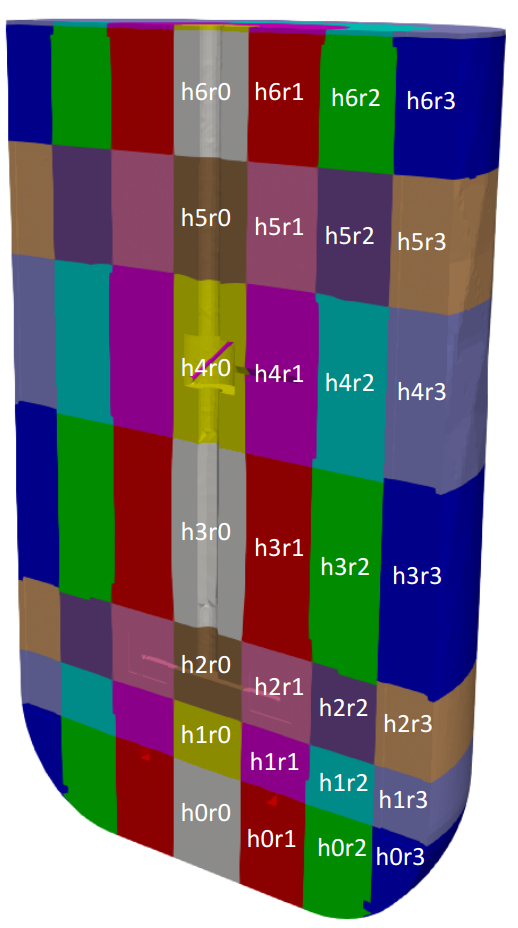
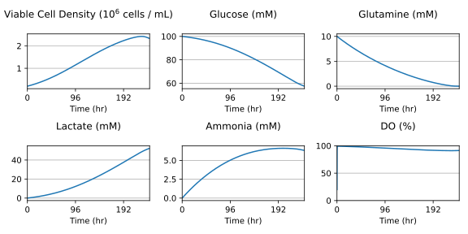
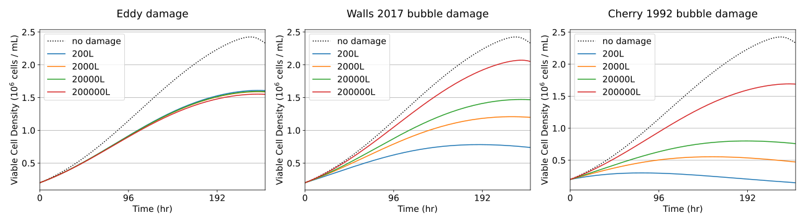

# About

This package has two main parts: a script to convert a OpenFOAM bioreactor simulation results into a set of compartment data, and methods that support simulating cell growth models in those compartments, incorporating different cell damage models.

# Requirements

The compartment generation part of this code requires OpenFOAM, Paraview, and PyFoam. It can be run using [this Docker container](https://hub.docker.com/repository/docker/kkiviat/openfoam/general), which includes OpenFOAM 10. 

Unfortunately it doesn't seem to work with the built-in Paraview in that container. Instead, you can provide a path to a different `pvpython` bin using the `--pvpython-path` flag. I ran this with Paraview 5.12 downloaded from [here](https://www.paraview.org/download/).

# Installation

Clone this repository and navigate to the `of-compartments` directory. From there, in your virtual environment of choice, you can run
```sh
pip install <path_to_of-compartments>
```

Then you can call the built-in scripts or import the packages in your own python scripts (see the examples directory).
 
For development, you can use poetry. Install the needed dependencies and activate the virtual environment with
```sh
poetry install
poetry shell
```

Alternatively, install the package in any virtual environment in editable mode with
```sh
pip install -e <path_to_of-compartments>
```

# Openfoam case requirements

This is designed to work with cases similar to those generated in <link>, which uses multiphaseEulerFoam in OpenFOAM 10.

The openfoam case is expected to have certain averaged fields written by function objects:
- epsilonMean.water
- alphaMean.air
- UMean.water

It assumes the case was run using `multiphaseEulerFoam`, and that bubbles were modeled as constant diameter with adjustment for pressure. The reference bubble diameter `d_ref` and the reference pressure `p_ref` can be specified as commandline arguments.

Cases are expected to contain a file `<case_name>.foam`, where `<case_name>` is the case directory.

# Generating compartment data

## Copying the case
These scripts will modify the case (e.g., removing any MRFProperties), so they should be run on a copy to avoid data loss. You can run

```sh
of_clone_case -c <source_case> -t <target_name>
```

This will clone the case over to the target location with only the latest (decomposed) time, and will reconstruct it. Alternatively, this can be done manually.

You also need to create a file `compartment_config` specifying the locations (in meters) of the vertical and radial slices (not including 0).

## Compartment configuration

Compartments are defined using Openfoam's `toposet` utility, based on a `compartment_config` file. This file lists the heights of the tops of compartments, and the outer radii of the compartments.

Example:
```compartment_config
heights: 0.30368 0.629856 1 1.34462 1.6 1.863
radii: 0.3504 0.6
```

By default, the `of_create_compartments` command will look for this inside the case directory, but you can override that with the `--compartment_config` argument.

## Creating compartments

To create the compartment data, run
```sh
of_create_compartments -c <case_dir> -o <output_dir>
```

Optionally, you can also specify the liquid density and viscosity, bubble diameter, and reference pressure. If you don't want to use the latest time, you can specify a time with the `--time` parameter.

This will put a set of files in the specified `output_dir` (in a subdirectory named after the case) that can be used by the compartment cell growth model.

An example set of compartments with default identifiers is shown here:



# Running a cell growth model

Once the compartment data have been generated, you can write a script using the `compartmentModel` module. This takes functions defining the growth the model and a list of damage models that define contributions to the cell death rate (e.g., due to bubbles or shear stress). Example models in `compartments/cellgrowth/damage_models.py` can be used, or you can use custom functions.

The `compartmentModel` can run a simulation in the specified compartments using those models. All the inputs must be defined as concentrations, and they are tracked on a per-compartment basis, with convection being modeled using the calculated flow between compartments.

See `examples` for example scripts using the compartment model.

# Viewing compartment data

There is a utility to view compartment data using the same .csv files as the cell growth code. Note that this utility does require that the compartment ids follow the naming scheme `h<i>r<j>` (see the above compartment image as illustration).

```sh
of_view_compartments -c <compartment_data_dir> -f <field>
```

where `field` can be `shear`, `high_shear_fraction`, `gas_holdup`, `kLa`, `epsilon`.

# Example compartment cell growth plots

Navigate to the examples directory
```sh
cd of-compartments/examples
```

Generate a plot showing a simple batch growth process over 244 hours at 200 L scale:
```sh
python cell_sim_batch.py -d compartment_data -c case_200L -t 244
```



Generate a plot comparing cell growth with different damage models at scales from 200 L to 200,000 L:
```sh
python cell_sim_eddy_bubble_damage.py -d compartment_data -c case_200L case_2000L case_20000L case_200000L -t 244
```


